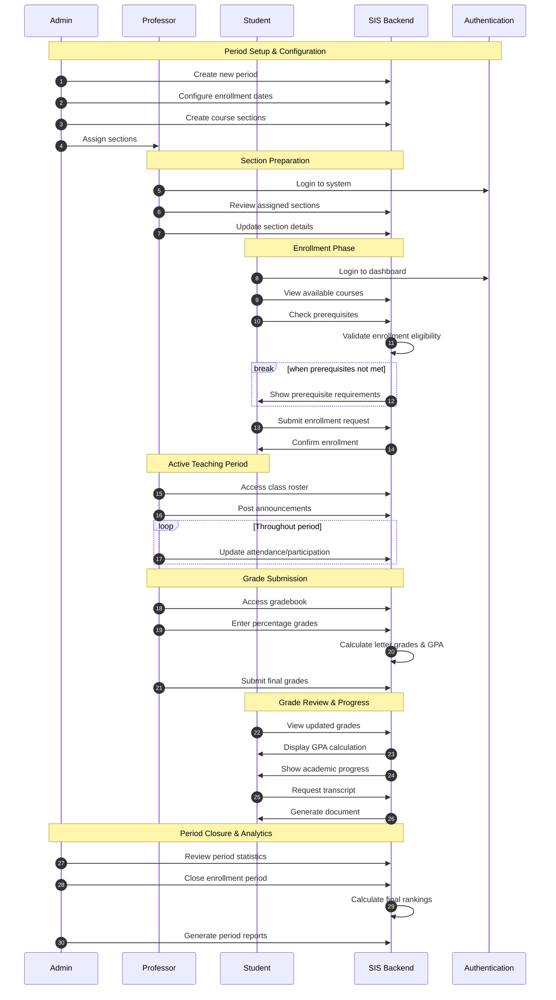
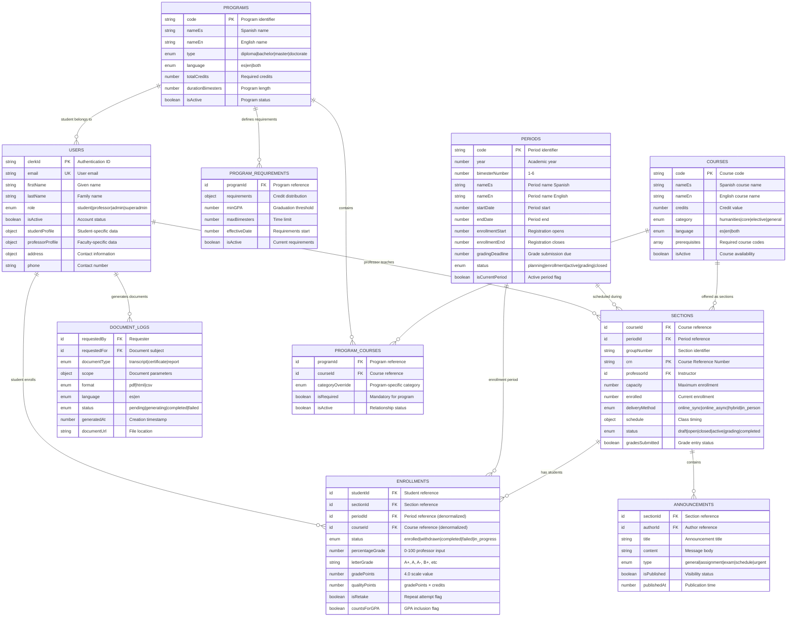

# Alef University - Student Information System (SIS)

A comprehensive **Student Information System** implementing role-based academic management with American grading standards. Built on Convex serverless architecture with TypeScript for scalable university operations.

## System Overview

The SIS implements a **complete academic management platform** with specialized interfaces for three primary user roles:

**Student Interface**
- Academic progress dashboard with program completion tracking
- Interactive curriculum visualization showing completed and pending courses
- Comprehensive grade history with GPA calculations
- Document generation capabilities for certificates and transcripts

**Professor Interface** 
- Section management with enrollment rosters
- Grade submission system using percentage-based American grading
- Teaching history with performance analytics
- Calendar integration for class scheduling

**Administrative Interface**
- Program and course catalog management
- Period administration with enrollment controls
- User management with role-based permissions
- System analytics and reporting tools

## Business Process Model

The system follows a **bimester-based academic calendar** with role-specific interaction sequences:



## Academic Model & Grading System

### Academic Structure
- **Bimester-based periods**: 6 periods per academic year (planning → enrollment → active → grading → closed)
- **Credit categorization**: humanities, core, elective, general course types
- **Program types**: diploma, bachelor, master, doctorate degrees
- **Prerequisite validation**: automated course eligibility verification

### American Grading Standards
- **Percentage grades**: 0-100% input by professors
- **Letter grades**: Automatic conversion (A+, A, A-, B+, B, B-, C+, C, C-, D+, D, F)
- **GPA calculation**: 4.0 scale with quality points computation
- **Passing threshold**: 65% minimum for course completion

### Navigation Structure
The frontend implements role-specific navigation following this architecture:

```
app/[locale]/(dashboard)/
├── page.tsx                    # Role-based dashboard entry point
├── academic/                   # Student academic section
│   ├── page.tsx               # Enrollment history and grades
│   ├── history/               # Complete academic transcript
│   └── progress/              # Visual progress tracking
├── teaching/                   # Professor section
│   ├── page.tsx               # Teaching overview
│   ├── gradebook/             # Grade management interface
│   └── progress/              # Teaching analytics
├── admin/                      # Administrative section
│   ├── page.tsx               # System overview
│   ├── courses/               # Course catalog management
│   ├── periods/               # Academic period control
│   ├── professors/            # Faculty management
│   ├── programs/              # Program administration
│   ├── students/              # Student records
│   └── users/                 # User account management
└── docs/                      # Documentation section
    ├── admin/                 # Administrative guides
    ├── progress/              # Progress interpretation
    ├── teaching/              # Faculty resources
    └── transcripts/           # Document procedures
```

## Convex Backend Structure

The system organizes business logic across specialized function modules:

### Core Function Modules
- **`auth.ts`**: Clerk authentication integration and user registration workflows
- **`users.ts`**: User profile management with role-based data access
- **`programs.ts`**: Academic program administration and requirement definitions
- **`courses.ts`**: Course catalog management with prerequisite handling
- **`sections.ts`**: Class section creation with professor assignment and scheduling
- **`enrollments.ts`**: Student enrollment processing and grade submission
- **`studentDashboard.ts`**: Academic progress calculations and transcript generation
- **`professorDashboard.ts`**: Teaching analytics and gradebook management
- **`admin.ts`**: Administrative operations and system-wide statistics

### Foundation Files
- **`schema.ts`**: Complete database schema with performance-optimized indexes
- **`types.ts`**: TypeScript interfaces, validators, and business rule definitions
- **`helpers.ts`**: Pure business logic functions for grade calculations and validations
- **`auth.config.ts`**: Clerk authentication provider configuration

## Database Schema Architecture

The system utilizes **10 core tables** optimized for academic operations with strategic indexing for performance:



## Business Logic Implementation

### Core Academic Operations

**Enrollment Validation**
- Prerequisite completion verification using course code dependencies
- Section capacity management with waitlist support
- Period-based enrollment window enforcement
- Duplicate enrollment prevention within the same period

**Grade Processing**
- American percentage-based grading (0-100%) with automatic letter grade conversion
- GPA calculation using 4.0 scale with quality points
- Support for incomplete grades with deadline tracking
- Retake handling with GPA impact configuration

**Academic Progress Tracking**
- Credit categorization by program requirements (humanities, core, elective, general)
- Real-time progress calculation with completion percentages  
- Academic standing determination based on GPA thresholds
- Graduation requirement validation

### Key Helper Functions

```typescript
// Grade calculation helpers from helpers.ts
calculateLetterGrade(percentageGrade: number): string
calculateGradePoints(percentageGrade: number): number  
calculateGPA(enrollments: Doc<"enrollments">[]): Promise<GradeSummary>

// Enrollment validation helpers
validatePrerequisites(studentId: Id<"users">, courseId: Id<"courses">): Promise<PrerequisiteValidation>
validateEnrollment(studentId: Id<"users">, sectionId: Id<"sections">): Promise<EnrollmentValidation>

// Academic progress helpers  
calculateAcademicProgress(studentId: Id<"users">): Promise<AcademicProgress>
validateGraduationRequirements(studentId: Id<"users">): Promise<GraduationValidation>
```

## Technical Architecture

### Performance Optimization
- **Strategic indexing**: Compound indexes for dashboard queries and enrollment lookups
- **Denormalization**: Period and course IDs stored in enrollments for efficient queries
- **Type safety**: End-to-end TypeScript with Convex validators
- **Serverless scalability**: Convex handles infrastructure scaling automatically

### Security & Authentication
- **Clerk integration**: Secure authentication with role-based access control
- **Role-based permissions**: Student, professor, admin, superadmin access levels
- **Data validation**: Server-side validation for all mutations
- **Audit trail**: Document generation logging with user tracking
```typescript
// NO complex activities table - grades stored directly in enrollments
interface Enrollment {
  finalGrade: number;      // CAL (1-5 scale)
  makeupGrade: number;     // HAB (0-100 scale) 
  effectiveGrade: number;  // What counts (makeup replaces final)
  letterGrade: string;     // For transcripts
}
```

**Optimized Queries**
### Index Strategy
The schema implements performance-optimized compound indexes for common query patterns:

```typescript
// Student dashboard queries
.withIndex("by_student_period", ["studentId", "periodId"])
.withIndex("by_student_section", ["studentId", "sectionId"])

// Professor dashboard queries  
.withIndex("by_professor_period", ["professorId", "periodId", "isActive"])
.withIndex("by_section", ["sectionId"])

// Administrative queries
.withIndex("by_program_course", ["programId", "courseId"])
.withIndex("by_period_status_active", ["periodId", "status", "isActive"])
```

## System Capabilities & Scale

The backend supports a comprehensive Student Information System designed for medium-scale academic institutions:

| **Core Functionality** | **Implementation Status** | **Target Scale** |
|-------------------------|---------------------------|------------------|
| **User Management** | Complete with role-based access | 250+ students, 20+ professors |
| **Academic Programs** | Multi-program support with shared courses | Unlimited programs |
| **Period Management** | Bimester-based with enrollment windows | 6 periods per year |
| **Course Catalog** | Prerequisite-aware with categorization | Unlimited courses |
| **Section Scheduling** | Professor assignment with capacity control | Multiple sections per course |
| **Grade Processing** | American system with GPA calculation | Real-time processing |
| **Progress Tracking** | Category-based credit distribution | Dynamic calculations |
| **Document Generation** | Audit-logged transcript and certificate generation | On-demand processing |
| **Analytics Support** | Performance metrics for all user roles | Real-time dashboards |

### Deployment Requirements

**Environment Configuration**
```bash
# Required environment variables
CONVEX_DEPLOYMENT=your-deployment-url
NEXT_PUBLIC_CLERK_PUBLISHABLE_KEY=your-clerk-public-key  
CLERK_SECRET_KEY=your-clerk-secret-key
```

**Database Deployment**
```bash
# Schema deployment with Convex
npx convex deploy
# Automatic index creation and optimization
```

The system is production-ready with comprehensive validation, audit trails, and performance optimizations suitable for academic institution requirements.

